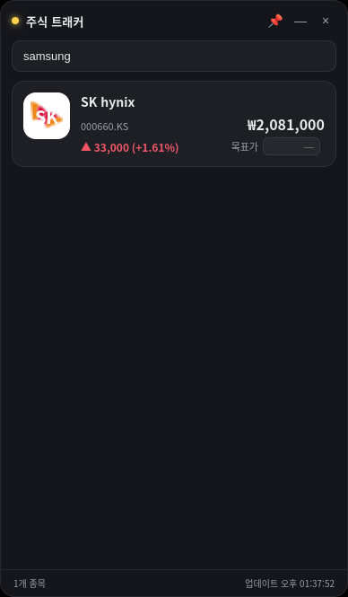

# 📈 Stock Widget — 실시간 주식 트래커

미국 🇺🇸 + 한국 🇰🇷 주식을 한 곳에서 트래킹하는 **미니멀 데스크탑 위젯**.
Electron 기반, 빌드 스텝 없음, 런타임 의존성 0개, **API 키 불필요** (Yahoo Finance).

<p align="center">
  
</p>

## ✨ 기능

- **둥근 정사각형 로고** — 기업 favicon 로고를 자동으로 가져오고, 실패하면 이니셜 + 그라데이션 아바타로 폴백
- **오늘 등락률 / 등락폭** — 한국 관례 색상 (상승 = 빨강 ▲, 하락 = 파랑 ▼)
- **현재 가격** — 통화별 포맷 (₩ 원 단위, $ 소수 2자리)
- **목표가** — 인라인 입력 + 현재가 대비 괴리율(%) 자동 표시
- **기업 검색 / 등록 / 삭제** — 미국·한국 통합 검색 (예: `삼성전자`, `AAPL`, `SK hynix`)
- **15초 주기 폴링** · **항상 위에 고정(📌)** · **프레임리스 드래그 창**
- 워치리스트는 로컬에 자동 저장 (재실행 시 복원)

## 🚀 실행

```bash
git clone https://github.com/HMCLMINU/stock-widget.git
cd stock-widget
npm install
npm start
```

> 요구사항: Node.js 18+ (내장 `fetch` 사용), Electron은 `npm install`로 자동 설치됩니다.

## 🗂 구조

| 파일 | 역할 |
|------|------|
| `main.js` | Electron 메인 — 창 생성, IPC, 영속화, 사내 프록시 CA 부트스트랩 |
| `yahoo.js` | Yahoo Finance API 래퍼 (검색 / 시세 / 로고, crumb 인증) |
| `store.js` | 워치리스트 JSON 영속화 (Electron `userData`) |
| `preload.js` | `contextBridge`로 안전한 API만 렌더러에 노출 |
| `renderer/` | UI — `index.html` · `styles.css` · `renderer.js` (vanilla JS) |

## 🔌 데이터 소스

모두 Yahoo Finance 비공식 엔드포인트이며 API 키가 필요 없습니다.

| 용도 | 엔드포인트 | 비고 |
|------|-----------|------|
| 시세 | `query1.finance.yahoo.com/v8/finance/chart/{symbol}` | crumb 불필요, 안정적 |
| 검색 | `query1.finance.yahoo.com/v1/finance/search` | 미국·한국 통합 |
| 로고 | `quoteSummary` → `assetProfile.website` → Google favicon | crumb 인증 |

한국 종목은 `005930.KS`(KOSPI) / `035720.KQ`(KOSDAQ) 형식의 심볼을 사용하며, 검색 시 자동으로 채워집니다.

## 🛡 보안 / 네트워크 메모

- 모든 외부 요청은 **메인 프로세스에서만** 수행 (CORS 회피, 렌더러는 `nodeIntegration` 비활성 + `contextIsolation` 유지)
- 사내 TLS 프록시 환경에서 Node `fetch`가 루트 CA를 신뢰하지 못하는 경우, 시스템 CA 번들(`/etc/ssl/certs/ca-certificates.crt` 등)을 자동 탐지해 `NODE_EXTRA_CA_CERTS`로 주입하고 1회 재시작합니다.

## 🧭 로드맵 (아이디어)

- [ ] 색상 관례 토글 (미국식 green/red ↔ 한국식 red/blue)
- [ ] 종목별 미니 차트(스파크라인)
- [ ] 목표가 도달 알림
- [ ] 트레이 아이콘 상주 / 창 위치 기억
- [ ] 드래그로 종목 순서 변경

## 📄 라이선스

[Apache-2.0](LICENSE)

---

> ⚠️ 본 앱은 비공식 Yahoo Finance 엔드포인트를 사용합니다. 데이터는 지연될 수 있으며 투자 판단의 근거로 삼지 마세요.
